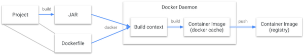
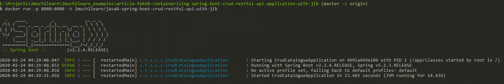

# A Step by Step guide on Containerizing Spring Boot CRUD RESTFul API Application with JIB

## Introduction

Jib is open-source Java containerizer that lets Java developers build containers using the existing Java tools we use to build and package our application

Jib is a fast and simple container image builder that handles all the steps of packaging your application into a container image. It does not require us to write a Dockerfile or have docker installed, and can be included as plugin in Maven and Gradle which creates containerized Java application in no time.

Below images helps us to visualise the difference between the usual docker build flow against the jib build flow

**Docker build flow**

**Docker build flow**



**Jib build flow**


## Build the Container Image

To build the container image with jib, run the build command as below to compile the project and create and push the image.

```bash:title=Maven
~:\> mvn clean package jib:build

....
....
[INFO]
[INFO] Container entrypoint set to [java, -cp, /app/resources:/app/classes:/app/libs/*, com.toomuch2learn.springboot2.crud.catalogue.CrudCatalogueApplication]
[INFO]
[INFO] Built and pushed image as 2much2learn/java8-spring-boot-crud-restful-api-with-jib
[INFO] Executing tasks:
[INFO] [==============================] 100.0% complete
[INFO]
[INFO] ------------------------------------------------------------------------
[INFO] BUILD SUCCESS
[INFO] ------------------------------------------------------------------------
....
....
```

```bash:title=Gradle
~:\> gradle clean jib

....
....
Got output:

credentials not found in native keychain

Using credentials from Docker config (C:\Users\narra\.docker\config.json) for 2much2learn/java8-spring-boot-crud-restful-api-with-jib

Container entrypoint set to [java, -cp, /app/resources:/app/classes:/app/libs/*, com.toomuch2learn.springboot2.crud.catalogue.CrudCatalogueApplication]

Built and pushed image as 2much2learn/java8-spring-boot-crud-restful-api-with-jib
Executing tasks:
[===========================   ] 88.9% complete
> launching layer pushers


BUILD SUCCESSFUL in 5m 49s
5 actionable tasks: 4 executed, 1 up-to-date
```

Images created with above build commands will be pushed to the registry and will not be available unless it is pulled.

```bash:title=List%20Docker%20Images
~:\> docker images
REPOSITORY          TAG                 IMAGE ID            CREATED             SIZE
hello-world         latest              fce289e99eb9        13 months ago       1.84kB
tomcat              8.0                 ef6a7c98d192        17 months ago       356MB

~:\> docker pull 2much2learn/java8-spring-boot-crud-restful-api-with-jib

~:\> docker images
REPOSITORY                                                TAG                 IMAGE ID            CREATED             SIZE
hello-world                                               latest              fce289e99eb9        13 months ago       1.84kB
tomcat                                                    8.0                 ef6a7c98d192        17 months ago       356MB
2much2learn/java8-spring-boot-crud-restful-api-with-jib   latest              e946277f08df        50 years ago        168MB
```

To create the image directly with Docker daemon and not pull it from registry, run the below build command.

```bash:title=Delete%20Image%20before%20trying%20with%20Docker%20demon
~:/> docker image rm 2much2learn/java8-spring-boot-crud-restful-api-with-jib
```

```bash:title=Maven
~:\> mvn clean package jib:dockerBuild
```

```bash:title=Gradle
~:\> gradle clean jibDockerBuild
```

```bash:title=
~:\> docker images
REPOSITORY                                                TAG                 IMAGE ID            CREATED             SIZE
hello-world                                               latest              fce289e99eb9        13 months ago       1.84kB
tomcat                                                    8.0                 ef6a7c98d192        17 months ago       356MB
2much2learn/java8-spring-boot-crud-restful-api-with-jib   latest              e946277f08df        50 years ago        168MB
```

Run the below command to inspect the image that is built by jib.

```bash:title=Inspecting%20image%20built%20by%20jib
~:\> docker inspect 2much2learn/java8-spring-boot-crud-restful-api-with-jib

[
    {
        "Id": "sha256:e946277f08dfbc25a28f17a348544d96592b1d854d21f1c61fde316fe5703f62",
        "RepoTags": [
            "2much2learn/java8-spring-boot-crud-restful-api-with-jib:latest"
        ],
        "RepoDigests": [],
        "Parent": "",
        "Comment": "classes",
        "Created": "1970-01-01T00:00:00Z",
        "Container": "",
        ....
		....
		....
            "Env": [
                "PATH=/usr/local/sbin:/usr/local/bin:/usr/sbin:/usr/bin:/sbin:/bin",
                "SSL_CERT_FILE=/etc/ssl/certs/ca-certificates.crt",
                "JAVA_VERSION=8u242"
            ],
            "Cmd": null,
            "Image": "",
            "Volumes": {},
            "WorkingDir": "",
            "Entrypoint": [
                "java",
                "-cp",
                "/app/resources:/app/classes:/app/libs/*",
                "com.toomuch2learn.springboot2.crud.catalogue.CrudCatalogueApplication"
            ],
            "OnBuild": null,
            "Labels": {}
        },
        "Architecture": "amd64",
        "Os": "linux",
        "Size": 167980775,
        "VirtualSize": 167980775,
        ....
		....
		....
    }
]
```

Only part of the output is shown for reference. Of the whole, below are few which might need some insight:

* **Created** - Checkout <ExternalLink href="https://github.com/GoogleContainerTools/jib/blob/master/docs/faq.md#why-is-my-image-created-48-years-ago">Why is my image created 48+ years ago?</ExternalLink> for more details.

* **Entrypoint** - Command configured for entrypoint points to the `Java main class` which should be bootstrapped to start the application using `java`.

## Launching the Container

Run the below command to bootstrap the SpringBoot application.

```bash:title=Command%20to%20start%20the%20application
~:\> docker run -p 8080:8080 -t 2much2learn/java8-spring-boot-crud-restful-api-with-jib
```

```bash:title=Command%20to%20start%20the%20application%20for%20specific%20spring%20profile
~:\> docker run -e "SPRING_PROFILES_ACTIVE=dev" -p 8080:8080 -t 2much2learn/java8-spring-boot-crud-restful-api-with-jib
```

```bash:title=Command%20to%20start%20the%20application%20with%20debugging%20capability
~:\> $ docker run -e "JAVA_TOOL_OPTIONS=-agentlib:jdwp=transport=dt_socket,address=5005,server=y,suspend=n" -p 8080:8080 -p 5005:5005 -t 2much2learn/java8-spring-boot-crud-restful-api-with-jib
```

This should start the application running on port 8080 internally and also exposed on host's port 8080.

